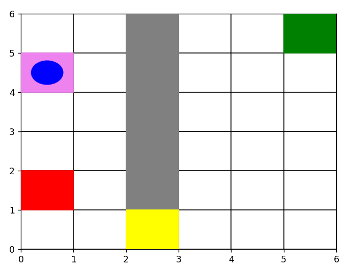

# Future-Task-Consideration-to-Mitigate-Side-Effects-in-RL
## Overview
This project addresses the challenge of mitigating negative side effects during the operation of autonomous robots in stochastic environments. The main focus is to enhance safe exploration by integrating an auxiliary reward mechanism into the learning algorithms, encouraging less harmful actions in the presence of environmental obstacles. The main ideology is to make the agent take actions that aren't irreversible by considering each obstacle in the environment as a possible potential for a future task with the obstacle.

Reference Paper - [Avoiding Side Effects By Considering Future Tasks]([https://example.com/auxiliary-reward-info](https://arxiv.org/abs/2010.07877))

**Prerequisites:**
- Python 3.x
- OpenAI Gym
- NumPy
- matplotlib

## Code explanation
QLearning.py - Code for barebone Q-learning algorithm on gridworld environment.

reversibilityWithAuxReward.py - Code for the Q-learning algorithm implemented with an auxiliary reward for the reversibility scenario.

stochasticWithAuxReward.py - Code for the Q-Learning algorithm implemented with considering future tasks in a stochastic policy setting.

stochasticWithAuxReward2futureTasks.py - Code for the Q-Learning algorithm implemented with considering future tasks which do not involve the box.

## Environment used
Designed a 6x6 gridworld environment implemented using the OpenAI Gym module in Python

